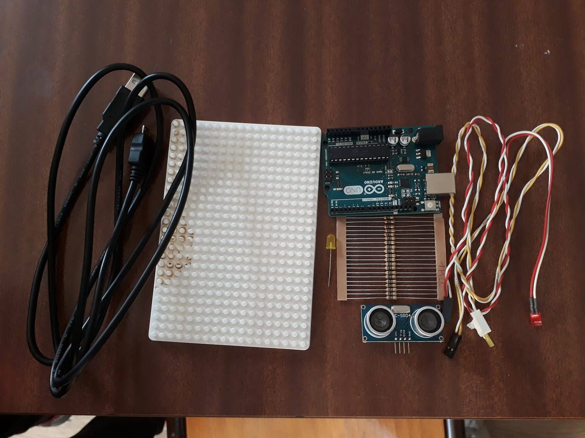
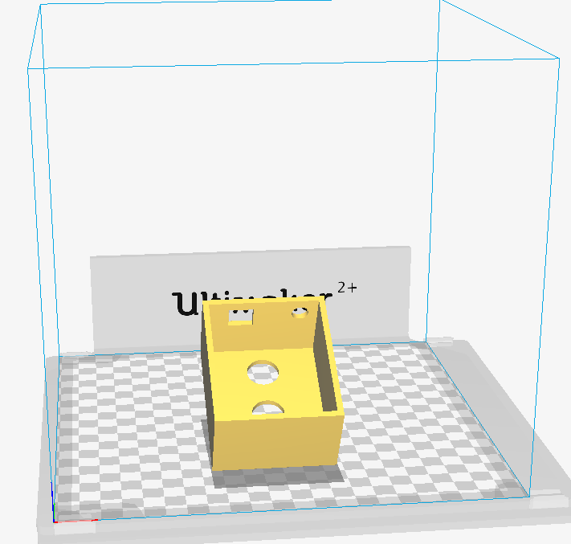
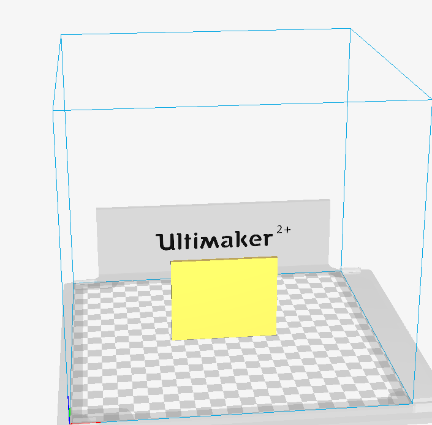
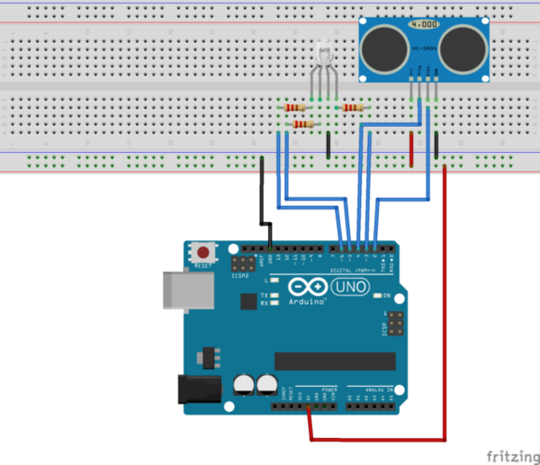

# Capteur-d-objet-CMN

## Présentation et objectifs
Etre capable de réaliser un projet au sein d'un FABLAB en présentant un système automatiser à partir d'un Arduino. -
Comprendre un tas d'objet qui nous entoure, tous ces capteurs, pour au final en creer un. -

## Pré-requis
Savoir les bases de l'informatique. -

### Matériel

Un Arduino	 6,65 EUR - 
Un câble USB	2,68 EUR -                                        
Un capteur de distance à ultrason	1,29 EUR - 
Une LED	0,10 EUR -
Les résistances	0,10 EUR -
Une Breadboard	2,36 EUR -    
Des fils de connexion	0,20 EUR -
Un adaptateur 5V	1,00 EUR -   

### Logiciels
Cura pour l'imprimante 3D -
Fritzing pour les schéma connectique -

## Capteur-d-objet-
Créer un détecteur de clef qui allumera une LED pour poser des objets métallique.  Le montage sera basé sur le capteur de distance à ultrason que l’on utilisera sous forme de seuil.  On partira donc du principe que le montage sera installé à un point fixe et que l’on détecte le passage devant le capteur. 
