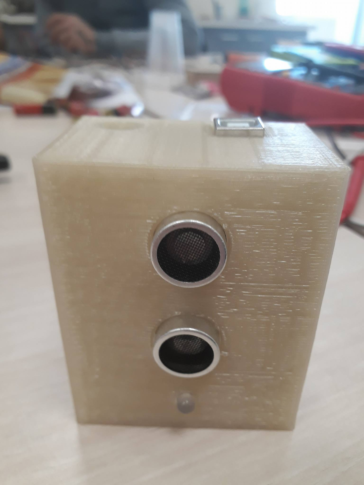

# Capteur-d-objet-CMN

## Présentation et objectifs
Créer un détecteur de clef qui allumera une LED pour poser des objets métallique.  Le montage sera basé sur le capteur de distance à ultrason que l’on utilisera sous forme de seuil.  On partira donc du principe que le montage sera installé à un point fixe et que l’on détecte le passage devant le capteur. 
Etre capable de réalier un projet au sein d'un FABLAB en présentant un système automatiser à partir d'un Arduino. 
Comprendre un tas d'objet qui nous entoure, tous ces capteurs, pour au final en creer un.  

## Pré-requis

### Matériel

Un Arduino  
Un câble USB  
Un capteur de distance à ultrason  
LED RGB à cathodes communes 
Une Breadboard  
3 Résistances 1/4W 270Ω ( 220Ω ou 330Ω peuvent également convenir) 
Des fils de connexions 
Un adaptateur 5V 
!(Elements.jpg) 

### Logiciels
